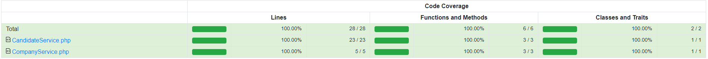

<p align="center"><a href="https://laravel.com" target="_blank"></a></p>

# Hiring Platform

This application aims to simulate a hiring platform. It's using PHP Laravel Framework (9.2) + MySQL + Docker + Redis.

## Instalation

You must have Docker, PHP (8.2) and Composer (I recommend the version 2) installed in your environment:

- Clone the repo and copy `.env.example` to `.env` file;
- Install de composer dependencies;
- Start docker containers with Laravel Sail

```
cp .env.example .env
composer install
./vendor/bin/sail up -d --build
```

Now, run migrate with seed command to create and fill the database:

```
./vendor/bin/sail php artisan migrate --seed
```

Now, let's generate the application key and clean the caches:

```
./vendor/bin/sail php artisan key:generate
./vendor/bin/sail php artisan optimize:clear
```

Finally, let's set up our front end:

```
./vendor/bin/sail npm install
./vendor/bin/sail npm run dev
```

Now you have the application running on [http://localhost](http://localhost)

## Mail

As email provider I recommend you use [Mailtrap](https://mailtrap.io/), that's easy to use and integrate with Laravel.

But you can use whatever you want.

`Don't forget to change variables in the .env file with your mail credentials`

## Queue

This application is using Redis and Supervisor to handle queues. It's started with the sail command, so you don't need to take care that manually.

You can check the settings into `docker/8.2/supervisord.conf`

## Code Coverage

This application have full test coverage on Repositories and Services:



## Final Notes

- Just fixed the company id for tests purpooses;
- Just created a wallet statement flow to log purposes, it's not being shown in the UI (it can be used in the future);
